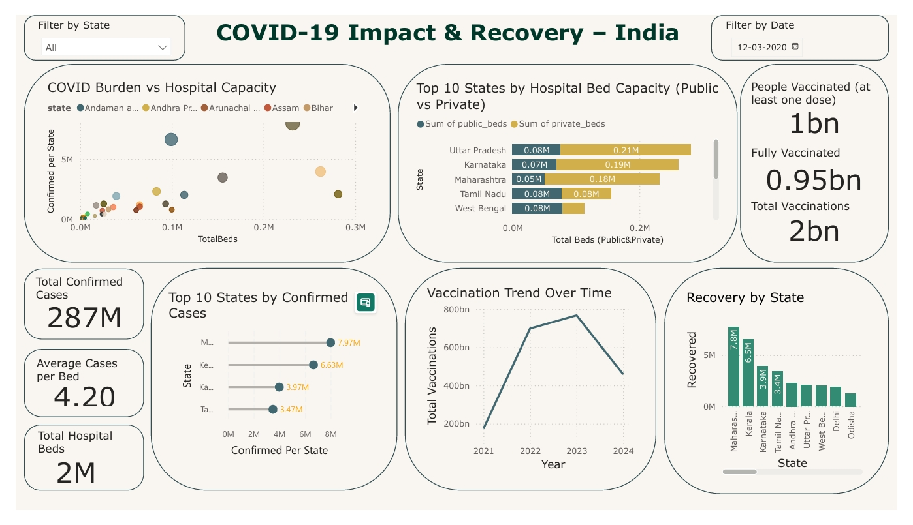

# 📊 COVID-19 Impact & Recovery – India  
**A Power BI Dashboard Project for HealthTech Insights**

This Power BI dashboard presents a detailed, data-driven analysis of how the COVID-19 pandemic impacted Indian states and how the healthcare system responded. From confirmed case loads and recovery counts to vaccination trends and hospital infrastructure, this project offers a state-wise deep dive into pandemic performance — built to support public health storytelling and policy insights.

---

## 📌 Project Overview

- 📈 Track COVID-19 trends across states
- 🏥 Compare hospital infrastructure to case burden
- 💉 Visualize India's massive vaccination drive
- 💚 Assess recovery trends with supporting data
- 📊 Built fully in Power BI with dynamic visuals & slicers

---

## 🔍 COVID Burden vs Hospital Capacity

This visual compares total hospital bed availability with the number of confirmed COVID-19 cases per state, using a calculated metric: **average cases per hospital bed**.

| Key Observations |
|------------------|
| Maharashtra had the highest burden: **4.20 average cases per bed** (7.97M cases, 231K beds).  
| Kerala (3.49), Karnataka (2.09), Tamil Nadu (1.83) also faced high pressure.  
| Small UTs like Andaman, Lakshadweep, and DNH had very low case load per bed (<0.01).  
| Delhi and Andhra Pradesh crossed the 1 case-per-bed mark, signaling infrastructure strain. |

This metric reveals how prepared (or overwhelmed) each region was based on infrastructure.

---

## 📊 Top 10 States by Confirmed Cases

| State             | Confirmed Cases |
|------------------|------------------|
| Maharashtra       | 7.97 Million     |
| Kerala            | 6.63 Million     |
| Karnataka         | 3.97 Million     |
| Tamil Nadu        | 3.47 Million     |
| Andhra Pradesh    | 2.32 Million     |
| Uttar Pradesh     | 2.09 Million     |
| West Bengal       | 2.03 Million     |
| Delhi             | 1.93 Million     |
| Odisha            | 1.29 Million     |
| Rajasthan         | 1.29 Million     |

Urban density and mobility patterns likely contributed to the heavier spread in these regions.

---

## 🏥 Top 10 States by Hospital Bed Capacity

This analysis ranks states by **total hospital beds (public + private)**, with cases-per-bed included to contextualize burden.

| State            | Total Beds | Public | Private | Cases/Bed |
|------------------|------------|--------|---------|------------|
| Uttar Pradesh    | 281,402    | 76,260 | 205,142 | 7.43       |
| Karnataka        | 262,109    | 69,721 | 192,388 | 15.14      |
| Maharashtra      | 231,739    | 51,446 | 180,293 | 34.40      |
| Tamil Nadu       | 155,375    | 77,532 | 77,843  | 22.35      |
| West Bengal      | 113,535    | 78,566 | 34,969  | 17.86      |
| Telangana        | 99,919     | 20,983 | 78,936  | 8.01       |
| Kerala           | 99,227     | 38,004 | 61,223  | 66.86      |
| Rajasthan        | 93,176     | 47,054 | 46,122  | 13.83      |
| Andhra Pradesh   | 83,230     | 23,138 | 60,092  | 27.89      |
| Madhya Pradesh   | 64,939     | 31,106 | 33,833  | 16.08      |

Kerala had comparatively fewer beds but one of the highest case burdens — emphasizing the need for healthcare resiliency beyond capacity alone.

---

## 💉 Vaccination Trend (2021–2024)

This line chart displays India’s vaccination rollout over four years.

| Year | Total Vaccinations |
|------|---------------------|
| 2021 | 1.74 Billion        |
| 2022 | 6.98 Billion        |
| 2023 | 7.68 Billion        |
| 2024 | 4.59 Billion        |

#### Key Notes:
- Rapid acceleration seen in 2022–2023.
- 2024 shows tapering — possibly due to saturation or shift in public health strategy.
- Reflects one of the largest public vaccination efforts globally.

---

## 💚 COVID-19 Recovery by State

This visual ranks states by recovery count to showcase healthcare effectiveness.

| State           | Recovered Cases |
|------------------|------------------|
| Maharashtra       | 7.79 Million     |
| Kerala            | 6.53 Million     |
| Karnataka         | 3.92 Million     |
| Tamil Nadu        | 3.42 Million     |
| Andhra Pradesh    | 2.31 Million     |
| Uttar Pradesh     | 2.06 Million     |
| West Bengal       | 2.00 Million     |
| Delhi             | 1.90 Million     |
| Odisha            | 1.27 Million     |
| Rajasthan         | 1.27 Million     |

High-burden states also had high recoveries, showcasing coordinated medical response and public awareness.

---

## 🧠 Tools & Techniques Used

- **Power BI Desktop** – visualizations, modeling, DAX
- **Custom DAX Metrics** – Cases per Bed, Recovery Rates, Dynamic KPIs
- **Custom Theme & Layout** – professional layout using color palette
- **Date slicers & interactivity** – user-driven filtering and exploration

---

## 📂 Datasets Used

| Dataset                 | Source              |
|-------------------------|---------------------|
| COVID-19 Case Data      | covid19india.org (via Kaggle) |
| Vaccination Data        | Kaggle (India COVID Vaccination Stats) |
| Hospital Infrastructure | Kaggle (India Hospital Beds) |

All datasets are publicly available and used solely for educational and analytical purposes.

---

## 🛠️ Project Structure

```
covid19-impact-india/
├── data/
│   ├── covid_data.csv                  # Daily COVID-19 case counts (state-wise)
│   ├── vaccination_data.csv            # Cumulative vaccinations (year-wise)
│   └── hospital_beds.csv               # Public + private hospital bed capacity
├── outputs/
│   └── dashboard_screenshot.png        # Final dashboard export
├── powerbi/
│   └── covid19_dashboard.pbix          # Power BI report file
└── README.md                           # Project documentation (you’re here!)
         
```

## 🖼️ Dashboard Preview



> Explore dynamic visuals, slicers, KPIs, and trend lines to understand India’s state-wise response and recovery.

---

## 👩‍💻 Author

**Varshita Yeddula**  
Data / BI Analyst | Health-Tech Focused  

📧 [varshitayeddula@gmail.com](mailto:varshitayeddula@gmail.com)  
🔗 [LinkedIn](https://www.linkedin.com/in/varshita-reddy-yeddula-45102b254)  
🔗 [GitHub Portfolio](https://github.com/VarshitaY)

---

> 💡 Built to communicate data impact, tell meaningful health-tech stories, and showcase practical BI skills.
